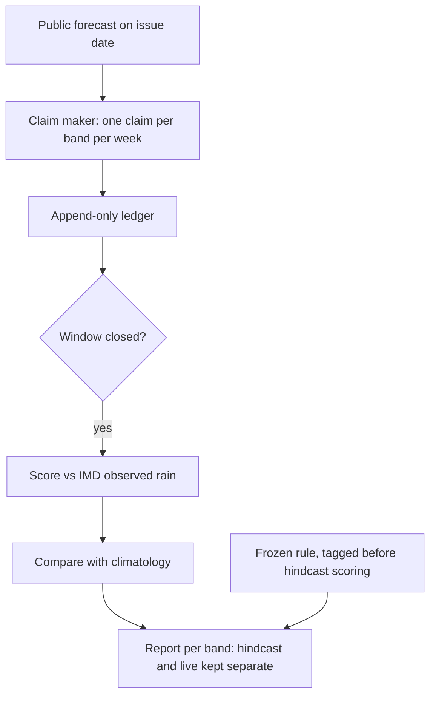
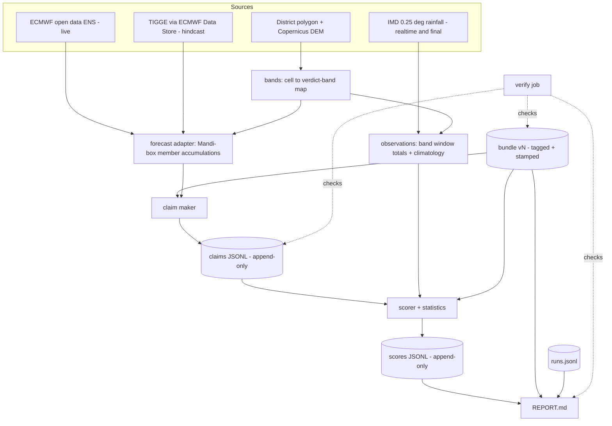
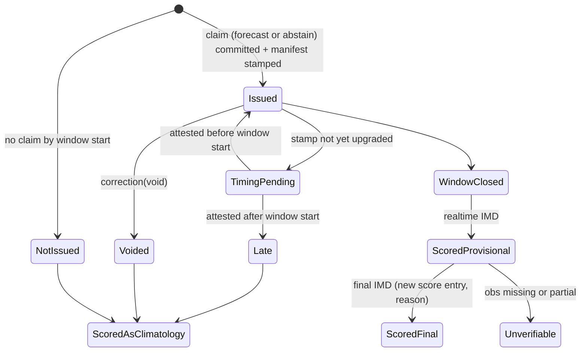

# Mandi Wheat Claim Ledger - Plan

## Goal Capsule

- **Objective:** For each altitude band in Mandi district, khetru can see from an honest, pre-registered record whether its sow-or-wait rain calls for rainfed wheat beat the crop calendar. The pre-registered hindcast gives the gate verdict; the live rabi 2027 season checks that live skill holds up against it.
- **Means:** A repo-resident claim ledger plus a minimal claim maker that starts by restating the public rain forecast per band (KTD1, KTD2).
- **Product authority:** This Product Contract, within the boundaries in `STRATEGY.md`. The website record page, call cards, and other ideation ideas (I2–I6 in `docs/ideation/2026-10-08-website-ideation.html`) are not active scope. On product behavior the Product Contract wins. On mechanism the Key Technical Decisions win. Units override neither.
- **Open blockers:** None for starting work. U1, this week, checks whether archived as-issued forecasts are reachable and whether the 0.25° grid separates the altitude bands. Later units adapt to its finding.
- **Stop conditions:**
  - If U1 finds no reachable as-issued archive, skip U9 and record the finding required by Success Criteria. Live work (U6, U7, U8, U10, U11) still proceeds: U8 then waives the cross-source precondition and freezes a live-only bundle without the hindcast fields, and the STRATEGY gates stay closed as Success Criteria states.
  - Never open archived pre-2026 Oct–Nov forecast values before the bundle tag exists (KTD11).
  - Never edit, delete, or rewrite a committed ledger line or a bundle tag (R6, R14).
- **Execution profile:** One owner-operator, in phases from Oct 2026 to the rabi 2027 settlement date (see Phased Delivery). Two units hold owner decisions that an agent must not make: U1 (feasibility verdict) and U8 (rule values and tagging).
- **Who finishes:** The project owner runs `ce-work` per phase, reviews, and pushes to `github.com/dsfx3d/khetru`. The bundle tag and each hindcast run are owner actions.

---

## Product Contract

Product Contract preservation: changed: R14 — adds a narrow `invalidated` hindcast-run state for stated code defects, which a re-run replaces (user-directed this session; see Key Decisions). Changed with the user's approval in review: R13 — gates open on a hindcast pass unless the live check fails, with "too early to tell" opening them provisionally. Clarified with the user's approval in review: R10 and AE1 count independent rain episodes, R10a labels skipped weeks "not issued", AE5 uses a Monday. Outstanding Questions now records which items planning resolved.

### Summary

Build a claim maker and an append-only claim ledger in the repo for Mandi rainfed wheat's sow-or-wait decision, per altitude band.
Claims are dated, checkable rain statements, scored weekly against IMD observed rainfall and against climatology.
A frozen rule is tagged before any hindcast scoring. Past seasons are then scored once as a labelled hindcast, which gives the gate verdict. Live rabi 2027 claims are appended as they are issued and checked against the hindcast's skill.
The implementation is a Python package in the uv workspace plus committed ledger data. A feasibility check comes first. ECMWF ensemble forecasts feed both the hindcast (TIGGE archive) and the live claims (open data, which we save ourselves from rabi 2026). A scheduled job on the public repo issues and scores claims, and an OpenTimestamps-stamped manifest is the proof that each claim came before its window.

### Problem Frame

`STRATEGY.md:32` makes claim reliability the one metric the website stage can measure, and `STRATEGY.md:24` and `STRATEGY.md:26` hold the chat assistant and new data domains until it shows the insights hold.
Nothing measures it yet: `apps/`, `packages/` and `py/` are empty, and no claim has ever been made.

The councils warned that "honest uncertainty" may mean "we don't know" most of the time, and that the metrics had "no thresholds or kill criteria" (`.scratch/council-transcript-20261008-council-q4-metrics.md:47`).
Without a record, khetru cannot tell in which bands a sharp call has been earned and in which it should fall back to the calendar ("rain came in 7 of the last 10 years").

The Android app ships regardless of the result. The record is first for the project owner. The same record is expected to later decide where the app speaks sharply, satisfy the STRATEGY gates, and back outreach.

### Key Decisions

- **Ledger plus a minimal claim maker, not the ledger alone.** A ledger with no claims proves nothing, and no call engine exists. Governs R1–R6. (session-settled: user-directed — chosen over a ledger-only scope tested with stub claims, and over a hindcast-only first pass: one piece of work yields a scored record.)
- **Mandi district, rainfed wheat, sow-or-wait.** Wheat is Mandi's largest crop (~66k ha) and is mostly rainfed, and sowing is the highest-stakes timing call. Governs R3. (session-settled: user-approved — offered alongside maize, paddy, urea top-dressing timing, and spray windows; the user took the recommended default and accepted a thin record of about one claim per band per week.)
- **Claims are checkable weather statements, not farm advice.** Public data can confirm rain in a band but not germination or yield. Governs R2. (session-settled: user-approved — accepted as the stated constraint on what the ledger can prove.)
- **Climatology is the only baseline for now.** It is free and mechanical, while GKMS advisories are free text that would need manual coding. Governs R8. (session-settled: user-approved — chosen over climatology plus the GKMS block advisory; the record can claim "beats the calendar", not "beats the official advisory".)
- **Hindcast now, first live season rabi 2027.** The rabi 2026 sowing window opens about 15 Oct 2026, too soon for a working claim maker. Governs R11, R13. (session-settled: user-approved — chosen over going live in kharif 2027 on maize, which would have meant switching crops.)
- **Pass/fail is a skill score against climatology with a minimum claim count.** A bare hit rate rewards safe calls. Governs R13. (session-settled: user-approved — chosen over a fixed hit-rate bar.)
- **The record lives in the repo, not on the website.** The project owner is the only reader for now, and the public OSS repo already makes the record public. Governs R16. (session-settled: user-approved — chosen over a static record page per band on the website, which is deferred.)
- **The first claim rule restates the public forecast per band.** This is the cheapest claim maker. It tests whether the public forecast beats climatology per band, not whether khetru adds anything over public forecasts; that is measured only when a later named rule is scored side by side with this one. Governs R4. (session-settled: user-approved — chosen with the repo-only ledger as the recommended combination.)
- **The record's main use is a per-band switch for sharp calls versus the calendar.** The user said the record should serve every listed purpose without naming one as primary, so this is an assumption. Governs R17.
- **The hindcast gives the gate verdict; the live season is a consistency check; the rule is frozen per season.** One live season holds only about 4–6 independent weather regimes, so neither pooling nor a higher cadence makes a live-only verdict meaningful, and extra correlated claims would inflate N without adding evidence. Mid-season rule versions would let results shape the criteria. Governs R10, R13–R15, R17. (session-settled: user-approved — accepted from the council of 2026-10-08, `.scratch/council-transcript-20261008-council-q5-ledger-verdict.md`; chosen over a pooled live-only verdict, a higher claim cadence, and a pre-registered aggregation policy for mid-season rule versions.)
- **A hindcast run can be invalidated only for a stated code defect, then re-run under the same tag.** Without this, a scorer bug found after the official run leaves either a wrong verdict or a broken rule. Governs R14. (session-settled: user-directed — chosen over keeping "scored once" strict with fixes reported only as exploratory, and over allowing invalidation only before the first live claim: a narrow, disclosed re-run under an unchanged tag keeps the pre-registration intact and fixes real bugs.)

### Requirements

**Claims**

- R1. Each claim records its altitude band, the crop stage (wheat sowing), the claim window, the rain statement, the stated probability, the issue date, its expiry, and the source the probability came from.
- R2. Each claim is worded as a rain statement that public observations can confirm or refute for that band and window (for example "≥10 mm rain in band within 7 days: 60%"), never as a farm outcome.
- R3. Claims cover every altitude band in Mandi district that has rainfed wheat, for the rabi sowing window only.
- R4. The first claim rule derives each band's probability from the public rain forecast available on the issue date. The source must give an exceedance probability for the claim's threshold and window (for example from ensemble members); otherwise the rule names a fixed deterministic-to-probability conversion, committed with the rule and never tuned on outcomes. Later rules are added as new, named rules, never as silent edits to earlier ones.
- R5. A claim may say "can't tell" with a stated reason (for example, no forecast coverage for the band). It is recorded and scored like any other claim.
- R6. Once a claim is recorded it is never edited or deleted. Corrections are new entries that reference the original.

**Scoring**

- R7. Each claim is scored after its window closes, at least weekly, against IMD observed rainfall for that band. The result is held, missed, or "can't tell".
- R8. Each claim's score is compared with climatology's probability for the same band, window, and rain threshold.
- R9. A score computed from provisional observations is marked provisional. It is re-scored when final observations replace them, and the record shows both the change and the reason.
- R10. A band or season with fewer independent rain episodes than the minimum N in the pass/fail rule shows "too early to tell", not a skill number presented as a verdict. "Too early to tell" is labelled visibly differently from "fail".
- R10a. A missed weekly issue date is recorded as not issued and never back-filled.

**Hindcast**

- R11. Past rabi seasons are scored using only forecasts as they were issued at each claim's issue date. A claim that would need data unavailable at that date is not made.
- R12. Hindcast and live claims are kept and reported separately and labelled at every point where a result is shown. A hindcast result is never presented as a live record.

**Pass/fail rule**

- R13. The rule states the rain threshold, the skill score, the threshold over climatology, the minimum N, the rainfall dataset version, and the settlement date by which observations are taken as final. The rain threshold is chosen from Oct–Nov climatology to fire in roughly 30–50% of weeks, but agronomic relevance to sow-or-wait (CSK HPKV or ICAR guidance) governs: if the relevant threshold fires less often, keep it and compute the power calculation and minimum N at its actual base rate. The rule judges two things, each with exactly three outcomes (pass, fail, too early to tell): the hindcast verdict, and the rabi 2027 live check, pooled across bands and pre-registered as "live skill is not significantly worse than hindcast skill". The live check is a non-inferiority test with a pre-registered margin: pass when the upper confidence bound of (hindcast skill − live skill) is below the margin, fail when the lower bound is above it, otherwise too early to tell. The margin and confidence level are fixed when the rule is tagged, using the power calculation. The STRATEGY gates open when the hindcast passes and the live check does not fail. A "too early to tell" live check is reported as such and leaves the gates open but provisional. A live-check fail closes them.
- R14. The rule is committed and tagged in the repo before any hindcast claim is scored, and that tag serves as pre-registration. The rule version tagged before the first live claim judges the whole rabi 2027 season. A later change is a new dated version that keeps the old one and takes effect from the next season; any mid-season variant, including pre-registered challenger rules, is reported only as exploratory and never changes that season's verdict. Each rule's hindcast is scored once, under a tag made before that run; a re-run or a later rule never replaces an earlier hindcast verdict, except that a re-run replaces a run marked invalidated under this rule. Rule tags are never moved or deleted, and the report lists every rule tag and every hindcast run with its date. A hindcast run may be marked invalidated only for a stated code defect, with a link to the fixing commit. The tag and every rule value stay unchanged. The run is then repeated under the same tag, and the report shows every run, the defect, and the fix.
- R15. When rabi 2027 ends, the record states the hindcast verdict, the pooled live check, and each verdict band's status in plain language, including "the calendar is as good as we are" when that is the result. Per-band "too early to tell" after rabi 2027 is the expected result, stated as such.

**Record**

- R16. A generated report in the repo shows, per band and in total, the claim counts, outcomes, and skill against climatology, with hindcast and live results separate and each claim rule's skill shown separately.
- R17. For each band the report states whether sharp calls have been earned (pass) or the band falls back to the climatology baseline (fail or too early to tell). A band stays on the calendar until its live claims, accumulated across seasons, reach N and pass, and also stays on the calendar unless the cost-loss check (a wrong "wait" against a wrong "sow") shows the chosen threshold and window can improve the sow-or-wait decision. A band gets its own verdict only if its observed rainfall comes from grid cells (or gauges) not shared with adjacent bands; bands that share observation cells are merged into one verdict band before the pass/fail rule is committed. Bands count as independent only when their observations come from distinct gauges, not merely distinct interpolated grid cells. If fewer than two independent verdict bands remain, the switch is district-wide (one verdict band); scoring against station gauges per band is deferred.
- R18. Nothing in the ledger, scoring, or report uses farmer data, visitor data, or farm coordinates.

### Key Flows



- F1. Weekly live cycle (rabi 2027)
  - **Trigger:** A weekly issue date falls inside the wheat sowing window.
  - **Steps:** Issue one claim per band from the forecast available that day; append it to the ledger; score claims whose windows have closed; regenerate the report.
  - **Outcome:** The ledger grows and the report reflects all closed claims.
  - **Covered by:** R1–R10, R16, R17
- F2. Hindcast run
  - **Trigger:** Run once, after the rule is tagged; re-run whenever a new claim rule is added (reported per rule, R16).
  - **Steps:** For each past rabi season and weekly issue date, issue claims using only forecasts as they were issued; score them against final observations; record them as hindcast.
  - **Outcome:** The record does not open at zero, and the hindcast stays visibly separate from the live record.
  - **Covered by:** R4, R11, R12, R16
- F3. Season close
  - **Trigger:** The rabi 2027 sowing window ends and its last claim windows have closed.
  - **Steps:** Apply the frozen rule: the pooled live check against hindcast skill, and each band's accumulated live claims against N.
  - **Outcome:** The pooled live check and each band are marked pass, fail, or too early to tell, stated in plain language.
  - **Covered by:** R13, R15, R17

### Acceptance Examples

- AE1. **Covers R10, R13.** Given a band with 4 independent live rain episodes and a rule minimum of N = 12, when the season closes, then that band shows "too early to tell" and falls back to the climatology baseline, even if every claim held.
- AE2. **Covers R9.** Given a claim scored "held" on provisional IMD data, when the final data shows rain below the threshold, then the claim is re-scored "missed" and the record shows the change and its reason.
- AE3. **Covers R5, R7.** Given a band with no forecast coverage on an issue date, when the claim maker runs, then it records "can't tell — no forecast coverage for this band", and that claim is counted in scoring.
- AE4. **Covers R14.** Given the rule was tagged on 2027-09-20, when a new threshold is committed on 2027-11-01, then the 2027-09-20 rule still judges the whole rabi 2027 season, the new version's scores appear only as exploratory, and it takes effect from rabi 2028.
- AE5. **Covers R11.** Given a hindcast issue date of 2023-10-23, when no archived forecast issued on or before that date exists for a band, then no hindcast claim is made for that band and date. Later data is never used to fill the gap.

### Success Criteria

- Before the first live rabi 2027 claim, the repo holds a rule tagged before hindcast scoring and a scored hindcast verdict, or a written finding that no archive of as-issued forecasts exists, or that the archive is too short to reach the pre-registered N (hindcast verdict "too early to tell"). In either case the gate cannot be met before about 2029, and STRATEGY must name a replacement gate (date to be set in planning).
- If the hindcast passes, the expected rabi 2027 result is a provisional gate opening, because the live check is expected to read "too early to tell" (R13).
- At the end of rabi 2027, the pooled live check and every Mandi wheat verdict band (bands merged under R17) have a stated outcome of pass, fail, or too early to tell, and someone who was not involved can trace each outcome from claims to scores to the rule.

### Scope Boundaries

- Deferred: a website record page per band, call cards, band permalinks, and voice or icon output.
- Deferred: the GKMS block advisory as a second baseline.
- Deferred: other crops (maize, paddy) and other decisions (urea top-dressing timing, spray windows).
- Deferred: claim rules beyond the restated public forecast, until the hindcast shows where the forecast falls short.
- Optional: hand-issued, unscored rehearsal claims during rabi 2026 (from about 15 Oct 2026) to surface data-latency, band-definition and forecast-access problems. Labelled rehearsal; never part of any verdict.
- Not in scope: any farmer- or visitor-facing input, including village selection or GPS.
- Not in scope: verifying farm outcomes such as germination, yield, or money saved.

Considered during planning and not built:

- **A hash chain inside the JSONL.** Stamped manifests of file lengths and hashes (KTD6), together with the prefix check, already catch rewrites and date the record. A chain would add a format outsiders must learn, without catching anything those miss. Revisit if the ledger leaves git.
- **Per-band sowing windows.** One 15 Oct – 15 Nov window applies to all bands, as KTD3 states. Revisit if the expected district-wide single verdict band ever splits.
- **A second forecast source as a live fallback.** It would break the one-model-family comparison (KTD2). An abstain is the honest outcome instead.
- **A test that greps `src/` for hard-coded semantic values outside `semantics.py`.** Too brittle against ordinary numbers. The single `semantics` module, the parity tests and the code freeze at the tag cover the same drift. Revisit if a constant is found duplicated in review.
- **Zenodo deposits or signed tags.** OpenTimestamps plus the public remote give independent time evidence at lower cost. Revisit if an outside reviewer asks for a DOI.

#### Deferred to Follow-Up Work

- Choosing a repo licence. The repo currently has none, and the ledger README carries the data attribution. Committing CC BY-licensed derived data does not depend on it, but outside contributors will need one.

### Dependencies / Assumptions

- The record's main use is the per-band switch in R17. The STRATEGY gates on the chat assistant and new data domains, and outreach, are expected to follow from the same record. This is an assumption, because the user did not name a primary purpose.
- A forecast source with archived as-issued forecasts covering past Mandi rabi seasons exists. If it does not, the hindcast shrinks or is dropped (R11, AE5).
- IMD daily gridded rainfall (~0.25°, about 27 km) is the observation source. Its cells span several altitude bands, so band-level scoring is approximate (unverified: Mandi's altitude range of roughly 500–4000 m).
- With about one claim per band per week across the roughly 15 Oct to 15 Nov window, one live season will not reach the minimum N in any band; per-band verdicts accumulate across seasons (R17).
- The Android app proceeds regardless of the outcome. A fail limits only sharp calls and the STRATEGY gates.

### Outstanding Questions

**Resolved during planning**

- Forecast source and archive depth: ECMWF ensemble, TIGGE for the hindcast and ECMWF open data for live claims (KTD2). U1 confirms access and season count.
- Band edges and which bands grow rainfed wheat: the Himachal agro-climatic zones serve as candidate bands, and a 0.25° grid cell joins the band covering most of its district area (KTD4, U3). With a ~27 km grid, one district-wide verdict band is the expected outcome under R17.
- Skill score: Brier skill score against leave-one-season-out climatology, with a cluster bootstrap (KTD8). The threshold over climatology and the minimum N come from the U8 power simulation.
- Which rule version judges a band's live claims accumulated across seasons: each claim is judged by the bundle active in its season. Claims accumulate across seasons only while the claim rule, threshold, window, and verdict-band map stay unchanged (KTD9).
- Cost-loss check: computed from the same contingency counts over a pre-registered C/L range, and its criterion is frozen in the bundle (KTD13).
- How a "can't tell" claim enters the skill score: as the climatology probability, contributing zero skill (KTD7).
- Climatology years: IMD final years from 1991 to the last final year before the tag. Each hindcast season leaves itself out (KTD8).
- The replacement-gate date (Success Criteria): if no usable archive exists, the owner sets it in the U1 finding.

**Decided when the bundle is authored (U8, before the tag)**

These are owner decisions, made once from U4's base-rate table and U8's power simulation, never from forecast outcomes.

- The rain threshold and claim window. Check them against CSK HPKV and ICAR guidance and against R13's base-rate target. If U4 shows the 7-day event is too rare (the CRIDA/HPKV note suggests mid-hill winter rain begins in the window in only ~10% of years), decide whether to score "next rain before the sowing cutoff" instead.
- The threshold over climatology, the minimum N, the non-inferiority margin, and the confidence level.
- What a pooled live-check or hindcast fail means for the STRATEGY gates, and what a pass unlocks.
- Whether the calendar fallback itself holds up. The report shows climatology's own reliability, but no gate depends on it in this version.

### Sources / Research

- `STRATEGY.md:24`, `STRATEGY.md:26`, `STRATEGY.md:32`, `STRATEGY.md:38`, `STRATEGY.md:56`: claim reliability metric, gates, privacy, website PoC role.
- `.scratch/council-transcript-20261008-council-q4-metrics.md:70`: calibrate per altitude band; reward honest "can't tell".
- `.scratch/council-transcript-20261008-council-q4-metrics.md:47`: critique, "No thresholds or kill criteria."
- `.scratch/council-transcript-20261008-council-q1.md:42`: one district, one crop.
- `docs/ideation/2026-10-08-website-ideation.html`: idea I1, the origin of this plan.
- `.scratch/council-transcript-20261008-council-q5-ledger-verdict.md`: council verdict on the hindcast gate and the per-season rule freeze.
- ICAR-CRIDA Mandi contingency plan (crop areas, monsoon timing): https://www.icar-crida.res.in/CP/HimachalPradesh/HP7-Mandi-31.12.2012.pdf
- KVK Mandi district profile: https://hillagric.ac.in/extension/dee-extra/KrishiVigyanKendras/kvk_mandi/pdf/AboutDistrict.pdf
- ICAR rabi advisory for Himachal (wheat sowing windows): https://vikaspedia.in/agriculture/crop-production/tips-for-farmers/icar-agri-advisory-for-rabi-2021-22/icar-rabi-season-agro-advisory-for-himachal-pradesh
- IMD 0.25° gridded daily rainfall: https://mausamjournal.imd.gov.in/index.php/MAUSAM/article/view/851
- Real-time IMD gridded data is provisional and revised later: https://archive.linux.duke.edu/cran/web/packages/imdR/vignettes/imdR-introduction.Rmd
- Cost-loss inputs (desk estimate 2026-10-08, low–medium confidence; C/L ≈ 0.08–0.34 mid hills, 0.05–0.2 low hills, 0.3–0.8 high hills; reseeding cost largely assumed):
  - CRIDA/HPKV rainfed technical note (moisture for sowing, re-sow below 50% stand, mid-hill winter rain onset 15 Oct–15 Nov in ~10% of years, AICRP sowing-date yields by station): https://zenodo.org/records/14292957
  - Palampur sowing-date trials (late-sowing penalty ~0.15–0.5%/day, irrigated or unstated): https://www.plantarchives.org/17-2/1439-1443 (3733).pdf
  - HP wheat seed price 2024-25: https://www.tribuneindia.com/news/himachal/wheat-seeds-now-available-at-agriculture-sales-centres
  - Wheat MSP RMS 2027-28, Rs 2,610/q: https://thefederal.com/category/news/cabinet-approves-rs-25-hike-in-wheat-msp-to-rs-2610-per-quintal-for-2027-28-258133
- TIGGE archive (from Oct 2006, now served through the ECMWF Data Store) shapes KTD2: https://confluence.ecmwf.int/spaces/TIGGE/pages/15467557/TIGGE+archive
- TIGGE WebAPI shutdown on 27 May 2026, after which access goes through `cdsapi`, shapes KTD2 and U1: https://forum.ecmwf.int/t/s2s-and-tigge-access-method/15020
- TIGGE licences by provider (CC BY or CC BY-NC) and the 48 h delay shape KTD2: https://ewds.climate.copernicus.eu/licences/tigge-licence
- ECMWF open data keeps a rolling archive of only a few days on the ECMWF portal, so we archive it ourselves (KTD2, U5); a public AWS mirror (`s3://ecmwf-forecasts`) keeps runs from 2023-01, which KTD11's guard must cover: https://www.ecmwf.int/en/forecasts/datasets/open-data
- Open-Meteo Historical Forecast data is a stitched series, not as-issued, so it is rejected for the hindcast: https://openmeteo.substack.com/p/introducing-the-historical-forecast
- GEFS operational archive (KTD2 fallback) and its reforecast, which is excluded: https://registry.opendata.aws/noaa-gefs/, https://registry.opendata.aws/noaa-gefs-reforecast
- `imdlib` usage for IMD gridded data (U4): https://imdlib.readthedocs.io/en/latest/Usage.html
- Precipitation data problems in the western Himalaya, behind KTD4 and the Risks: https://hess.copernicus.org/articles/22/5097/2018/
- Verification method (KTD8, KTD13): Wilks, *Statistical Methods in the Atmospheric Sciences* (4th ed., 2019), on the Brier skill score and resampling; Weigel et al. 2007 (MWR), on BSS bias; Richardson 2000 (QJRMS), on relative economic value; Hamill & Juras 2006 (QJRMS), on false skill from pooled climatology.

---

## Planning Contract

### Key Technical Decisions

- KTD1. **One Python package, `py/evidence` (`khetru-evidence`), plus committed ledger data under `ledger/mandi-wheat/`.**
  - The repo already runs pytest across `py/*` through `pnpm test`, and every data library this work needs is Python.
  - Keeping code and data apart lets a second ledger reuse the code later.
  - Heavy geospatial dependencies sit in an optional `geo` group, used only by U3.
  - Separate archive and scoring packages were rejected: they would share every semantic rule (KTD3) across a package boundary for no gain.
- KTD2. **ECMWF ENS is the single forecast family, and both paths produce one normalised forecast record.**
  - The hindcast reads TIGGE through the ECMWF Data Store (`cdsapi`). The TIGGE WebAPI closed on 27 May 2026.
  - Live claims read ECMWF open data. The ECMWF portal keeps only about 2–3 days, so U5 saves it daily from rabi 2026 onward. A public AWS mirror holds open-data runs from 2023-01, so the KTD11 date guard applies to every forecast adapter, not only TIGGE.
  - The record covers the control plus all perturbed members, in mm. It holds cumulative precipitation at every native step from 0 to 360 h, on cells checked against the IMD 0.25° lattice, with the init time, the model cycle, the source URL and the raw-file SHA-256.
  - Raw values are saved, never window totals, so a window chosen later in U8 can still be computed from rabi 2026 data.
  - The two adapters differ in units (open data in metres, TIGGE in kg/m²), in member layout and in how the grid is produced. A test on a rabi 2026 date compares TIGGE against our own saved open-data run for the same init. Agreement within a stated tolerance is a precondition for U8, waived only when U1 finds no reachable as-issued archive (then U8 freezes a live-only bundle).
  - Excluded: reforecasts (GEFSv12, ECMWF reforecasts), which are not as-issued (R11), and NCMRWF and IMD fields in TIGGE, which are CC BY-NC.
  - If U1 finds TIGGE unreachable, the fallback is the NOAA GEFS operational archive on AWS, labelled with its shorter depth. Choosing it triggers a plan revision of U5, U8 and U9 before work continues, so live and hindcast stay one model family.
- KTD3. **Time semantics live in one pure module, `semantics.py`, which reads its values from a bundle.** Given a bundle and an issue date, it returns the forecast run and step range, the time the run counts as available, the IMD rain-days, the window start and end (the end is also the expiry), and the late cutoff. Forecast, observation, claim and scoring code all go through it. The default values below go into `bundles/dev/` first, and U8 copies the tested values into v1:
  - Issue dates are the Mondays from 15 Oct to 15 Nov.
  - Each claim uses that Monday's 00 UTC run. The run counts as available from init + 9 h.
  - The forecast window covers steps 24–192 h.
  - The observed window is the seven IMD rain-days starting at the first 03 UTC after issue. The 3 h offset is documented, not corrected, and is the same on both paths. U1 confirms IMD's date convention.
  - **For claims written in real time (`live`, and `exploratory` runs on the live schedule), on-time is decided by OpenTimestamps, never by `issued_at`, commit dates or runner clocks.** Such a claim is on time only if an upgraded OpenTimestamps proof shows its manifest (KTD6) attested before window start. Until the proof is upgraded, the claim's timing is pending. A late claim is scored as not issued (KTD7).
  - **For `hindcast` claims and retroactive `exploratory` claims, the timing test is forecast availability (R11):** the run's init + 9 h must be at or before the issue time. The bundle tag and the hindcast run entries carry the pre-registration evidence instead. Each score records which timing test it applied.
  - **What each timing test proves (owner-approved 2026-10-11).** The issue time of a claim that was not written in real time is the time its issue date's own run counts as available, so the forecast-availability test passes when the run the claim names is available no later than that.
    - `live`: the OpenTimestamps proof shows the claim existed before its window started.
    - `hindcast`: the forecast-availability test shows only that the claim names a run that was available by its issue date. It does not show when the claim was written. That nothing later was used rests on the as-issued archive, the bundle tag and the run entries.
    - `exploratory`: the same forecast-availability test, with the same limit. An exploratory claim never enters a verdict.
- KTD4. **Space semantics.**
  - Everything is computed on the IMD 0.25° lattice. One function in `bands.py` computes area-weighted band means for both forecast and observed fields. Cells are weighted by the area of the district polygon inside them.
  - One coverage rule applies to both fields. Below the bundle's coverage share, a forecast becomes an abstain and an observation becomes `unverifiable`.
  - Candidate bands are the Himachal agro-climatic zones I–III, which hold the rainfed wheat. Each cell joins the band covering most of its district area. Bands that share cells merge into one verdict band (R17).
  - IMD publishes no list of gauges per cell, so the default is one district-wide verdict band.
  - Scoring on the native ENS grid was rejected because observations exist only on the IMD lattice.
  - **Exploratory view bands (owner-approved 2026-10-11).** An area may be issued and scored beside the verdict bands as a view: a new write-once file `bands/view-<name>.csv` holding its cells, weights that sum to 1, and one band named `view-<name>`. The registered map and its verdict bands are unchanged. A view goes through the same band-mean function and coverage rule, with its own weights; a view of one cell has weight 1 on that cell and stands for the whole cell, since one cell has no boundary to draw. A view is never a verdict band: it has no verdict, no band switch (R17), no hindcast, and no place in any skill figure or pooled check. The first view is the cell 32.00°N, 76.75°E; see `docs/findings/2026-10-foothill-cell-exploratory-view.md`.
- KTD5. **The probability is a fixed plotting position over the ensemble members.**
  - k is the number of members whose band-mean window total reaches the threshold, out of n members.
  - The bundle names a formula of k and n that never returns 0 or 1, and nothing is fitted to outcomes. This satisfies R4's ensemble path.
  - Calibrated or kernel-dressed methods were rejected because they need training on outcomes, which would breach R4's "never tuned on outcomes".
- KTD6. **The ledger is append-only canonical JSONL with natural-key IDs.**
  - **Encoding:** one entry per line, with sorted keys, compact separators, UTF-8 and a trailing `\n`. The appender checks the trailing newline before each single-write append. Timestamps are UTC with a `Z` suffix, from an injected clock.
  - **Files and kinds:**
    - Claims go in `claims/live.jsonl`, `claims/exploratory.jsonl` or per-run hindcast files, and scores mirror that split under `scores/`.
    - Every entry carries `kind` (`live`, `hindcast`, `exploratory`).
    - `live.jsonl` holds only `live` entries, and `exploratory.jsonl` only `exploratory` entries.
    - An entry for a view band (KTD4) is always `exploratory`, under any bundle and after any tag; the ledger refuses it under `live` or `hindcast` (owner-approved 2026-10-11).
    - Hindcast entries carry a `run_id` that has a `started` entry.
    - A `live` entry needs its bundle tag as an ancestor of its commit, and an issue date inside that bundle's season (R12).
  - **IDs come from the natural key, never from time or randomness:**
    - Claims, abstains and `not_issued` entries: (ledger, kind, bundle, verdict band, issue date). There is exactly one of these per key. Once a claim exists, `not_issued` is refused for that key.
    - Scores: (claim ID, observation vintage).
    - Runs: (bundle, run sequence).
  - **Corrections** may only void a claim or fix a field that does not affect scoring. A voided claim is scored as not issued (R6).
  - **Scores and re-scores:**
    - Scores live in separate append-only files.
    - A re-score appends a new entry with `supersedes` and `reason` (R9).
    - Each claim has exactly one current score, with no forks or cycles in the supersede chain.
    - A score carries its claim's `kind` and bundle.
  - **Outcome labels:**
    - Outcomes are `held`, `not_held` and `unverifiable`.
    - The report labels them "held", "missed" and "can't tell" (R7).
    - `not_issued` is labelled "not issued" (R10a).
  - **Write-once evidence.** Files under `inputs/`, `observations/`, `bands/`, `bundles/` and `stamps/` are never changed once committed, except for adding new files. Every claim and score records the SHA-256 of each evidence file it used.
  - **Manifest.** Each write cycle stamps a manifest of every ledger file's length and SHA-256 with OpenTimestamps. `verify` checks that the current files extend every stamped manifest. Outsiders can then detect a rewritten history without trusting GitHub settings.
- KTD7. **Scoring of empty and doubtful entries.**
  - Abstains (R5), `not_issued` entries (R10a) and late claims are scored as if they had issued the climatology probability. They add zero skill but count toward N.
  - `unverifiable` outcomes are excluded from the skill score, and the report shows their count.
- KTD8. **Statistics: hand-written numpy, cross-checked against an independent library in tests.**
  - The primary score is the Brier skill score against climatology. Climatology probabilities use a smoothed empirical frequency, never 0 or 1, from a day-of-year ± window set in the bundle.
  - The hindcast uses leave-one-season-out tables. The live season uses all final IMD years up to the tag. Both are frozen in the bundle, and the bundle names the exact IMD final data by file hash.
  - Brier differences are averaged across verdict bands per issue date. The cluster bootstrap resamples whole seasons for the hindcast and issue dates for the live season, with frozen seed and resample count.
  - N counts independent rain episodes in observed IMD data, never claims, with positive and negative episodes counted separately.
  - Verdict logic is in the decision table below. The R13 margin is set from the power simulation and frozen in the bundle before the tag. The bundle also pre-registers that when the hindcast's lower skill bound turns out at or below the margin, the live check reads "too early to tell", so a zero-skill live season can never pass.
- KTD9. **The pre-registration bundle covers rules, data and code, and it is tagged, timestamped and enforced.**
  - **Contents of `bundles/v<N>/`:** the claim rule, the pass/fail rule (R13), the semantics values (KTD3, KTD4), the band map, the climatology tables, the IMD file hashes, the hindcast season range, the model cycle, the settlement date, the cost-loss criterion, the STRATEGY consequences, and the power-simulation output.
  - **Tagging:** an annotated, pushed tag `mandi-wheat/bundle-v<N>`, stamped with OpenTimestamps.
  - **Data freeze:** the scorer and the runner refuse to run when the working-tree bundle differs from the tag.
  - **Code freeze:** the frozen code is the pure rule-bearing logic: `semantics`, the band-mean function, the claim and score cores with verdict logic, and forecast and observation normalisation. These live in dedicated modules whose exact paths the bundle lists, and each is complete before the tag; drivers, loaders and report helpers stay in unfrozen files so U9–U11 can land after the tag. Network retrieval sits in separate modules (`fetch_forecasts`, `fetch_observations`) that stay unfrozen, because their output is pinned by record hashes and the cross-source and parity tests. A mid-season retrieval fix is appended as a ledger entry naming the defect and commit, and the report lists it. `verify` fails when commits after the tag touch the frozen logic, unless an `invalidated` or `aborted` run entry (KTD10) names the commit. During the live season the weekly job applies the same check.
  - Running the hindcast from a checkout of the tag was rejected. It would block defect fixes under the same tag, which R14 now allows.
  - The first tagged bundle's hindcast is the gate verdict, and a later bundle's hindcast never replaces it (R14).
  - Live claims accumulate across seasons only while the claim rule, threshold, window and band map are unchanged.
- KTD10. **Hindcast runs follow a lifecycle in `runs.jsonl`: `started`, `aborted`, `recorded`, `invalidated`.**
  - `started` must be pushed and stamped before any Oct–Nov TIGGE fetch.
  - A run's claims, scores and `recorded` entry land in one commit.
  - `aborted` needs a reason and leaves no claims or scores. It allows a fresh `started`. When the abort was caused by a code defect, the entry names the defect and its fix commit, and the code-freeze check accepts that commit as it does for `invalidated`. Without a named fix, bundle, code and data are frozen, so a re-run reproduces the same result.
  - `invalidated` needs a code defect and a fix commit, and allows one new run under the same tag.
  - The report lists every run. This implements the Key Decision on hindcast invalidation (R14).
- KTD11. **Development data policy.**
  - Code is built and tested only on synthetic fixtures, IMD observations, and forecasts saved from rabi 2026 onward.
  - Pre-2026 Oct–Nov forecast values are never fetched before the tag, from TIGGE or from any open-data mirror.
  - Rabi 2026 is development data, never part of any verdict. It is also where the KTD2 cross-source test runs.
  - Until bundle v1 is tagged, the project does not compute, report or tune on Brier scores or skill against climatology for rabi 2026. Exploratory scoring reports only pipeline and integrity results (counts, outcome labels, re-derivability), so no rule value can be chosen from forecast outcomes.
  - This is a rule of conduct, and the entry format is not the safeguard (owner-approved 2026-10-11). A claim publishes its probability and IMD rainfall is public, so anyone can work out a Brier score for a rabi 2026 claim. The code enforces the rule where it can: `evidence score` prints outcomes and counts only, and the skill aggregates refuse a bundle with no recorded tag.
- KTD12. **Live operations run as GitHub Actions on the public repo, as a single writer.**
  - **Single writer.** The archive and weekly workflows share one `concurrency` group that never cancels a run in progress. When a push is rejected as non-fast-forward, the job drops its local commit, fetches, re-runs its idempotent commands on the new HEAD, and pushes again, a bounded number of times. JSONL is never rebased or merged.
  - **Monday jobs.** The weekly job runs at 10:30 UTC, with retries at 12:30 and 14:30. That leaves at least 9 hours for OpenTimestamps attestation before Tuesday 00 UTC.
  - **Phase A:** issue, `verify --skip-report` (every integrity check except report freshness), commit, push, stamp the manifest. A failure in Phase B never undoes or delays Phase A.
  - **Phase B:** backfill `not_issued`, score, report, full `verify`, commit, push. The push-time `verify` job accepts a Phase A commit with a stale report only when it touches nothing but claim files, manifests and stamps.
  - **No run available.** If no run is available by the last retry, each verdict band gets an abstain with the reason "source unavailable" (R5).
  - **Verify on every push.** A `verify` job runs on every push and PR, and every writer also runs `verify` before pushing.
  - **Repository rules.** A GitHub ruleset blocks force-push and deletion on `main`, and blocks updating or deleting `mandi-wheat/*` tags.
  - **Local runs.** During the season, local runs never write `live` entries.
  - **Rejected alternative.** A local cron was rejected because it depends on the owner's machine being on.
- KTD13. **Cost-loss value per verdict band.** It uses Richardson's relative economic value, computed from the claims' contingency counts and acting on claims with p ≥ C/L. The bundle pre-registers the C/L range (the desk estimate in Sources) and the criterion: value above zero across the band's range. R17 reads this result, but it does not enter the R13 verdict.
- KTD14. **Provisional verdicts and final verdicts are distinct.**
  - Weekly scores use IMD real-time data, recorded with its vintage.
  - When the final dataset arrives, each claim gets one superseding final score (R9).
  - At season close the verdict is stated as provisional (R15). It becomes final on the bundle's settlement date, and later revisions are ignored.
  - If final data is missing by the settlement date, the report says so.

### High-Level Technical Design

Components and data flow:



Claim lifecycle (per verdict band and issue date):



Hindcast run lifecycle (KTD10):

```mermaid
stateDiagram-v2
  [*] --> Tagged: bundle vN tagged + stamped
  Tagged --> Started: bundle hash == tag; started pushed + stamped before any fetch
  Started --> Recorded: claims, scores, verdict in one commit
  Started --> Aborted: crash or stated reason; no entries kept
  Aborted --> Started: fresh run, same tag (deterministic)
  Recorded --> Invalidated: stated code defect + fix commit
  Invalidated --> Started: new run, same tag
  Recorded --> [*]
```



Verdict decision table (KTD8, R13). The numbers come from the bundle.

| Check | Too early to tell | Pass | Fail |
|---|---|---|---|
| Hindcast verdict | independent events < min N (positive or negative) | N met and BSS lower bound > threshold over climatology | N met and lower bound ≤ threshold |
| Live check, rabi 2027, pooled | otherwise | upper bound of (hindcast BSS − live BSS) < margin | lower bound of (hindcast BSS − live BSS) > margin |
| STRATEGY gates (R13) | hindcast too early to tell and live check not fail | hindcast pass and live check not fail; provisional while the live check is too early to tell | hindcast fail, or live check fail |
| Band switch (R17) | independent live episodes accumulated under KTD9 < min N | min N met, pass, and cost-loss value > 0 over the band's C/L range | anything else |

### Output Structure

```text
py/evidence/
  pyproject.toml
  src/khetru_evidence/
    cli.py            # `evidence` entry point: archive, issue, score, hindcast, report, verify, bundle, stamp
    ledger.py         # canonical JSONL entries, natural-key IDs, append, invariants, manifests
    semantics.py      # pure time rules from a bundle (KTD3)
    bands.py          # band map build + load (geo extra)
    observations.py   # IMD loaders, vintages, base-rate tables (unfrozen)
    obs_core.py       # pure observation normalisation, band window totals, episodes, climatology (frozen at tag)
    forecasts.py      # normalised ENS record from open data or TIGGE (frozen at tag)
    fetch_forecasts.py    # network retrieval for ENS (unfrozen, KTD9)
    fetch_observations.py # network retrieval for IMD (unfrozen, KTD9)
    claim_core.py     # pure make_claim core (frozen at tag)
    claims.py         # live/exploratory driver (unfrozen)
    views.py          # the registered map and exploratory view bands, loaded for the drivers (unfrozen)
    score_core.py     # pure score core, Brier, BSS, bootstrap, verdicts, cost-loss (frozen at tag)
    scoring.py        # `evidence score` driver and display aggregates (unfrozen)
    bundle.py         # bundle schema, hash, tag check, power simulation
    hindcast.py       # run lifecycle
    report.py         # REPORT.md
  tests/
    fixtures/         # synthetic grids, tiny real IMD/ENS subsets
ledger/mandi-wheat/
  README.md           # how to read and re-derive; data attribution
  bands/              # band map + provenance
  observations/       # Mandi-box IMD cell values per product and vintage
  inputs/             # Mandi-box ENS member accumulations per run
  bundles/dev/        # untagged development values, exploratory only
  bundles/v1/         # bundle.toml, climatology tables, IMD hashes, power.md
  claims/live.jsonl, claims/exploratory.jsonl
  scores/live.jsonl, scores/exploratory.jsonl
  hindcast/v1/        # runs.jsonl, per-run claims and scores
  stamps/             # OpenTimestamps proofs of manifests and tags
  manifests/          # per-cycle ledger file lengths + hashes
  REPORT.md
docs/findings/        # U1 feasibility finding
.github/workflows/    # evidence-archive.yml, evidence-weekly.yml, evidence-verify.yml
```

### Phased Delivery

| Phase | When | Units | Exit |
|---|---|---|---|
| 1. Feasibility and saving forecasts | Oct 2026, raw ENS saving before ~15 Oct where possible | U1, U2, U5 (open-data archiving first) | Finding written; daily raw ENS saving running for rabi 2026 |
| 2. Ground truth and geography | Oct–Dec 2026 | U3, U4 | Band map and base-rate table committed |
| 3. Claim and score | Dec 2026 – spring 2027 | U6, U7 | Rabi 2026 development data scores end to end as `exploratory`, with skill output held back until the tag (KTD11) |
| 4. Pre-registration, hindcast, report | By ~Aug 2027, after the cross-source test passes | U8, U9, U10 | Bundle v1 tagged and stamped; hindcast verdict recorded, or the "no archive" finding |
| 5. Live season | Sep 2027 – settlement date | U11 | Weekly job live before the first Monday on or after 15 Oct 2027 |

### Implementation Constraints

- Python ≥ 3.13 (`.python-version`), managed by uv. Add the package as a `py/*` workspace member, matching `pyproject.toml`'s `[tool.uv.workspace]`.
- Nothing reads, stores or infers farmer, visitor or farm-coordinate data (R18). The only geography is the district polygon and the DEM.
- Committed forecast records cover only the Mandi box plus one cell of margin (KTD2). Raw GRIB downloads go under a gitignored cache path added to `.gitignore`.

---

## Implementation Units

| U-ID | Title | Key files | Depends on |
|---|---|---|---|
| U1 | Feasibility check and finding | `docs/findings/`, `ledger/mandi-wheat/rehearsal-2026.md` | — |
| U2 | Package scaffold, ledger store, semantics, verify | `ledger.py`, `semantics.py`, `cli.py`, `bundles/dev/`, `evidence-verify.yml` | — |
| U3 | Bands and verdict-band map | `bands.py`, `ledger/mandi-wheat/bands/` | U2 |
| U4 | Observations, climatology, base rates | `obs_core.py`, `observations.py`, `ledger/mandi-wheat/observations/` | U2, U3 |
| U5 | Forecast adapters and daily archiving | `forecasts.py`, `evidence-archive.yml`, `ledger/mandi-wheat/inputs/` | U2 |
| U6 | Claim maker | `claim_core.py`, `claims.py` | U2, U3, U5 |
| U7 | Scoring and statistics | `score_core.py`, `scoring.py` | U2, U4, U6 |
| U8 | Pre-registration bundle | `bundle.py`, `ledger/mandi-wheat/bundles/v1/` | U3, U4, U5, U7 |
| U9 | Hindcast runner | `hindcast.py`, `ledger/mandi-wheat/hindcast/` | U1, U5, U6, U7, U8 |
| U10 | Report | `report.py`, `ledger/mandi-wheat/REPORT.md` | U7, U8 |
| U11 | Live weekly operations | `evidence-weekly.yml`, `ledger/mandi-wheat/README.md` | U5–U8, U10 |

### U1. Feasibility check and finding

- **Goal:** Settle this week whether a gate verdict is reachable at all. This means reaching the as-issued archive, confirming the grid conventions, and judging whether the bands can be separated.
- **Requirements:** R11, R17, Success Criteria (the "no archive" finding); Dependencies / Assumptions.
- **Dependencies:** None.
- **Files:** `docs/findings/2026-10-mandi-forecast-archive-and-grid.md`; `ledger/mandi-wheat/rehearsal-2026.md` (the optional hand-issued rehearsal log from Scope Boundaries, never read by code).
- **Approach:**
  1. Register for, or confirm, ECMWF Data Store access to TIGGE. Retrieve one ECMWF ENS precipitation field for a July date, never Oct–Nov (KTD11). Record the member layout, the steps and units, the 0.25° interpolation option, the licence for ECMWF fields, and the season range.
  2. If TIGGE is closed to new users, check the depth of the GEFS operational archive on AWS (KTD2 fallback) and record it. Also record the ECMWF open-data AWS mirror (same model family, from 2023-01) as a possible short hindcast source, by listing, not opening, Oct–Nov files.
  3. Confirm IMD access via `imdlib` for both the final and the real-time products, record IMD's daily accumulation convention (KTD3), and record the final-release timing if it is published.
  4. Overlay the IMD 0.25° cells on the Mandi polygon. Count the cells, and look for any public list of gauges per cell (KTD4).
  5. Write the finding: the archive source, the number of usable seasons (rabi 2006–2025 at most, excluding 2026), the expected verdict-band count, and whether a hindcast can run. If none can, the finding states that the gate cannot be met before about 2029, and the owner sets the date by which STRATEGY names a replacement gate.
- **Execution note:** This is investigation, not product code. Any throwaway scripts stay out of `py/evidence`. Do U1 alongside U2 and U5, which must not wait for it.
- **Test expectation:** none — produces a written finding. U2–U5 encode its facts.
- **Verification:** The finding names one archive (or none) with its season range and licence, the IMD convention, the cell count, and the default verdict-band count. No pre-2026 Oct–Nov forecast value was opened.

### U2. Package scaffold, ledger store, semantics, verify

- **Goal:** A `khetru-evidence` package whose ledger can only grow, whose time rules come from one place, and a `verify` that catches any break of the KTD6 invariants before and after a push.
- **Requirements:** R6, R10a, R12, R14 (tags never moved), R18.
- **Dependencies:** None.
- **Files:** `py/evidence/pyproject.toml`, `py/evidence/src/khetru_evidence/{__init__,cli,ledger,semantics}.py`, `ledger/mandi-wheat/bundles/dev/bundle.toml`, `py/evidence/tests/test_ledger.py`, `py/evidence/tests/test_semantics.py`, `py/evidence/tests/test_verify.py`, `.github/workflows/evidence-verify.yml`, `.gitignore`, `uv.lock`.
- **Approach:**
  1. Scaffold the package with `uv init --package`, following the README's "Adding a package" section. Add the `evidence` console script and the optional `geo` group (KTD1).
  2. In `ledger.py`, implement:
     - canonical encoding;
     - natural-key IDs and the typed entries (KTD6);
     - a single-write appender that checks for a trailing newline;
     - manifest writing.
  3. In `semantics.py`, implement the pure time rules (KTD3). Seed `bundles/dev/bundle.toml` with the KTD3 default values. Entries made under the dev bundle are always `exploratory`.
  4. Make `evidence verify --base <ref>` check:
     - that JSONL files extend the base byte-for-byte;
     - that every line parses, is canonical and fits the schema;
     - that natural keys are unique across each whole file;
     - supersede-chain integrity;
     - kind and file placement (R12);
     - that write-once evidence paths are unchanged;
     - that the current files extend every stamped manifest;
     - that recorded tag SHAs still resolve.

     U8 adds the code-freeze check and U10 adds the report check.
  5. Add a CI workflow that runs `pnpm test` and `verify` on every push and PR. Add the GitHub ruleset for `main` and the `mandi-wheat/*` tags (KTD12). The ruleset is an owner action, recorded in the README.
- **Patterns to follow:** The root `package.json` `test:py` script (pytest exit code 5 is tolerated).
- **Test scenarios:**
  - Appending a claim writes one canonical line ending in `\n`. Re-reading it returns an equal entry.
  - Appending onto a file whose last line has no trailing newline is refused, and the file is unchanged.
  - Appending a second claim for the same (ledger, kind, bundle, verdict band, issue date) is refused.
  - Appending `not_issued` for a key that already has a claim is refused.
  - Two entries with the same fields in a different key order encode to identical bytes.
  - `verify` passes when the new file equals the old file plus valid lines.
  - `verify` fails, naming the file and line, when an old line is edited, deleted or reordered.
  - `verify` fails on a non-canonical or schema-invalid new line.
  - `verify` fails on a duplicate natural key added by hand.
  - `verify` fails on a `hindcast` entry in `live.jsonl`.
  - `verify` fails on a changed file under `inputs/`.
  - `verify` fails on a file shorter than its stamped manifest.
  - `verify` fails on a tag that now resolves to a different commit.
  - For a Monday issue at 10:30 UTC, `semantics` returns forecast steps 24–192 h from the 00 UTC run, a window starting at the next 03 UTC, an expiry at the window end, and a late cutoff at window start.
- **Verification:** `pnpm test` collects and passes the new tests. In a scratch branch, the verify workflow fails on a deliberately edited ledger line.

### U3. Bands and verdict-band map

- **Goal:** A committed, reproducible map from IMD cells to bands to verdict bands, built per R17, plus the one band-mean function both data paths use.
- **Requirements:** R3, R17, R18.
- **Dependencies:** U2.
- **Files:** `py/evidence/src/khetru_evidence/bands.py`, `py/evidence/tests/test_bands.py`, `ledger/mandi-wheat/bands/band-map.csv`, `ledger/mandi-wheat/bands/PROVENANCE.md`.
- **Approach:**
  1. Load the Mandi district polygon from a named open source and Copernicus DEM GLO-30 tiles, recording their versions and hashes.
  2. Classify DEM pixels into candidate bands (KTD4). Give each 0.25° cell the band that covers most of its district area, with an area weight per cell.
  3. Merge bands per R17. If fewer than two verdict bands remain, produce one district-wide band and record the reason.
  4. Expose one pure band-mean function, including the shared coverage rule (KTD4). The forecast and observation paths both call it.
- **Test scenarios:**
  - On a synthetic 3×3 grid, the area weights sum to the polygon area within tolerance.
  - A cell split 60/40 between two bands goes to the majority band.
  - Two bands that share a cell merge into one verdict band.
  - With no independent gauge evidence, the output is one district-wide verdict band, and its reason is filled.
  - A cell outside the polygon gets weight 0.
  - With a band below the coverage share, the band-mean function reports insufficient coverage, and the result is the same whether the input is a forecast field or an observed field.
- **Verification:** Rebuilding from the recorded sources reproduces `band-map.csv` byte for byte.
- **Deviation (owner-approved 2026-10-10):** `band-map.csv` maps cells to weights and verdict bands only. It holds no band column and registers no zone edges, because they change no score and the published edges disagree. The code still classifies elevation and merges bands that share cells. See `docs/findings/2026-10-mandi-elevation-zones.md`.

### U4. Observations, climatology, base rates

- **Goal:** Band window rainfall from IMD with dataset vintages, a climatology method, and the base-rate table that R13's threshold choice needs.
- **Requirements:** R7, R8, R9, R13 (base-rate input), Outstanding Questions (rare-event check).
- **Dependencies:** U2, U3.
- **Files:** `py/evidence/src/khetru_evidence/obs_core.py`, `py/evidence/src/khetru_evidence/observations.py`, `py/evidence/src/khetru_evidence/fetch_observations.py`, `py/evidence/tests/test_observations.py`, `ledger/mandi-wheat/observations/`, `ledger/mandi-wheat/base-rates.md`.
- **Approach:**
  1. Load IMD final and real-time 0.25° data via `imdlib` for the Mandi box. Commit write-once cell-level files per product and vintage, with their hashes.
  2. Compute band window totals through `semantics` and the band-mean function. Count independent rain episodes using the dry-day gap from the bundle (KTD8).
  3. Compute climatology probabilities, including the leave-one-season-out tables U8 freezes.
  4. Produce the base-rate table: Oct–Nov weekly base rates for 2, 5, 10 and 20 mm in 7 days, plus "next rain before the sowing cutoff", with positive and negative episode counts per season.
- **Execution note:** Implement test-first against synthetic grids with hand-computed totals.
- **Test scenarios:**
  - Daily band values 0,0,4,6,0,0,1 total 11 mm. The window holds at 10 mm and not at 12 mm.
  - The window starts at the first 03 UTC rain-day after the issue time, not on the issue day.
  - The leave-one-season-out climatology for season Y excludes Y. A synthetic year with rain every week does not raise its own climatology.
  - The climatology probability is never 0 or 1.
  - A missing cell-day below the coverage share produces `unverifiable`.
  - Two rain days separated by fewer than the dry-day gap count as one episode.
  - A provisional and a final vintage of the same day are both kept, and each is loaded by its vintage name.
- **Verification:** The base-rate table is committed. Every climatology value can be reproduced from the committed observation files.

### U5. Forecast adapters and daily archiving

- **Goal:** Save as-issued ENS runs for Mandi from rabi 2026 onward as raw values, and read TIGGE into the same normalised record.
- **Requirements:** R4, R11, R12.
- **Dependencies:** U2.
- **Files:** `py/evidence/src/khetru_evidence/forecasts.py`, `py/evidence/src/khetru_evidence/fetch_forecasts.py`, `py/evidence/tests/test_forecasts.py`, `py/evidence/tests/test_forecasts_crosssource.py`, `.github/workflows/evidence-archive.yml`, `ledger/mandi-wheat/inputs/`.
- **Approach:**
  1. Build the open-data adapter. Every day from 1 Oct to 30 Nov, fetch the 00 and 12 UTC ENS runs, with control and perturbed members and cumulative precipitation at every native step from 0 to 360 h. Crop to the Mandi box plus one cell of margin, convert to mm, and write one compressed, write-once normalised record per run (KTD2). Window totals are never stored.
  2. Build a TIGGE adapter that produces the same record. One shared guard, used by both adapters, refuses pre-2026 Oct–Nov dates unless a bundle tag exists and its `started` entry is on origin (KTD10, KTD11).
  3. Add the daily archive workflow in the shared concurrency group with the reset-and-redo push routine (KTD12). It skips init times that are already saved.
  4. Add ECMWF CC BY 4.0 attribution to the ledger README.
- **Execution note:** Ship the open-data archiving first, by about 15 Oct 2026 if possible, even before any derived code exists. Every day missed is rabi 2026 development data lost for good.
- **Test scenarios:**
  - From a fixture GRIB with 2 members, a 2×2 box and 6-hourly steps, totals rebuilt from the saved record for any window match a direct sum of the GRIB.
  - An open-data value given in metres and a TIGGE value given in kg/m² for the same rainfall both come out as the same mm in the record.
  - The control member is present in the record, separate from the perturbed members, and n counts both.
  - A record whose cell coordinates are off the IMD lattice is rejected.
  - Archiving the same init time twice writes one file.
  - A pre-2026 Oct–Nov TIGGE request with no tag is refused, and so is a 2024-10 open-data request (AWS mirror) with no tag.
  - A missing step is recorded as a failure, never as a silently short series.
  - The TIGGE adapter decodes one non-Oct–Nov date from each ENS resolution or model-cycle era between 2006 and 2025, so archive-format surprises surface before the tag (KTD11 permits this).
  - The cross-source test (run once rabi 2026 runs exist): for one rabi 2026 init time, band-mean totals from TIGGE and from our saved open-data run agree within the stated tolerance.
- **Verification:** The archive workflow has committed a real run, and its hash matches a fresh download made the same day. The cross-source test passes before U8 starts.

### U6. Claim maker

- **Goal:** Issue one claim per verdict band per issue date, or record why none was issued, from one pure core shared by every driver.
- **Requirements:** R1, R2, R3, R4, R5, R10a, R12; F1, F2.
- **Dependencies:** U2, U3, U5.
- **Files:** `py/evidence/src/khetru_evidence/claim_core.py`, `py/evidence/src/khetru_evidence/claims.py`, `py/evidence/tests/test_claims.py`, `py/evidence/tests/test_parity.py`.
- **Approach:**
  1. Write a pure claim core, with no I/O and no `kind`. From the bundle, band map, normalised record and issue date it returns the claim body: R1's fields, the templated rain statement (R2), p by KTD5, the evidence-file hashes, and abstain with a reason when coverage is short (R5).
  2. `evidence issue --date` is the live/exploratory driver. It adds `kind`, writes the claim, and adds the code SHA.
  3. `evidence issue --backfill-missing` appends `not_issued` only for keys with no claim, after their window has started (R10a).
  4. U9's driver calls the same core.
- **Test scenarios:**
  - With 51 members, 30 of them at or above 10 mm, p equals the bundle formula's value, and the statement names rain, never a farm outcome.
  - Covers AE3. With no record for the date, the claim is an abstain reading "can't tell — no forecast coverage for this band".
  - Issuing the same date twice writes nothing the second time.
  - `--backfill-missing` writes `not_issued` for a missing key whose window has started, and never writes a claim for a past date.
  - Every R1 field is present, and the expiry equals the window end from `semantics`.
  - Parity: the same fixture through the live driver and the hindcast driver gives identical claim bodies apart from `kind` and `run_id`.
- **Verification:** The saved rabi 2026 inputs produce `exploratory` claims for every Monday in the window, each re-derivable from its referenced files.
- **Deviation (owner-approved 2026-10-11, after the council of that date):** `evidence issue` also writes one claim per exploratory view band (KTD4) for each issue date, and `evidence score` scores it. The claim core, the score core and the band-mean function are the same and are not changed for it; the view lives in the drivers and in `views.py`. A view's entries are `exploratory` even when the bundle issues the verdict bands as `live`, so they are timed by forecast availability. `scoring.standing` leaves a view's scores out.

### U7. Scoring and statistics

- **Goal:** Score each closed claim against IMD and climatology with one pure core, and compute every verdict quantity in R13 and R17.
- **Requirements:** R7, R8, R9, R10, R13, R15, R17; AE1, AE2.
- **Dependencies:** U2, U4, U6.
- **Files:** `py/evidence/src/khetru_evidence/score_core.py`, `py/evidence/src/khetru_evidence/scoring.py`, `py/evidence/tests/test_scoring.py`, `py/evidence/tests/test_scoring_crosscheck.py`.
- **Approach:**
  1. Write a pure score core. It takes a claim, an observation vintage and a climatology table, and returns the outcome and the Brier score of the claim and of climatology (KTD7).
  2. `evidence score` appends scores for closed claims that have no score for the current vintage. A changed vintage gets a superseding entry with its reason (R9, KTD14). The timing test follows KTD3: the OpenTimestamps proof for real-time claims, and forecast availability for hindcast and retroactive claims. A real-time claim whose timing is still pending waits for its proof.
  3. Aggregates: BSS, the cluster bootstrap CIs, the episode N, the verdicts (decision table), and the cost-loss value (KTD13). Seeds come from the bundle.
- **Execution note:** Implement test-first. The cross-check tests compare against an independent library (`scores` or `xskillscore`), which is a dev dependency only.
- **Test scenarios:**
  - A claim at p = 0.6 that held scores Brier 0.16. Against climatology 0.3, the difference is 0.33.
  - Abstain, not-issued and late claims each score a Brier difference of exactly 0.
  - A live claim whose stamp is attested after window start is scored as late.
  - A hindcast claim with no stamp, whose forecast run was available before issue time, is scored on its forecast, not as late.
  - An unverifiable outcome is excluded from BSS and counted for coverage.
  - Covers AE2. A provisional `held` re-scored as `not_held` on final data appends a superseding entry with its reason, and leaves the original unchanged.
  - Scoring the same claim and vintage twice writes nothing the second time, so there is no fork.
  - Covers AE1. A band with 4 independent live episodes and minimum N = 12 is "too early to tell", even when every claim held.
  - The bootstrap gives the same result for the same seed, and a different one for a different seed.
  - With synthetic perfect forecasts over 20 seasons the verdict is pass. Forecasts equal to climatology give fail.
  - Non-inferiority: equal skill with a large live N gives pass. With 4 live clusters it gives too early to tell.
  - With a hindcast lower skill bound at or below the margin, the live check is too early to tell even when live skill matches hindcast skill.
  - Cost-loss at C/L = 0.2 on a synthetic table matches a hand computation of Richardson's value.
  - Brier and BSS agree with the independent library to 1e-12.
  - Parity: the same claim and vintage scored through the live and hindcast paths give identical score bodies apart from `kind` and `run_id`.
- **Verification:** The rabi 2026 exploratory claims score end to end, and every number can be re-derived from committed files. Before the tag, the rabi 2026 run prints no Brier or skill figures (KTD11).
- **Deviations and open items (owner-approved 2026-10-11, after the council of that date, `.scratch/council-transcript-20261011-u7-owner-calls.md`):**
  - A score entry stores no Brier score. It holds the outcome, the scored probability and climatology's probability, and `score_core.brier_pair` derives the Brier scores from them. This departs from approach step 1.
  - Each score lists every climatology file by hash under `evidence` until U8 freezes the climatology tables. The field keeps its shape; U8 only shortens the list.
  - Open for U8: live claims are not scored until OpenTimestamps stamping exists, because their timing test needs the attested time.
  - Open for U8 and U11: an `exploratory` claim made on the live schedule is timed by forecast availability, not by OpenTimestamps as KTD3 asks. The September 2027 rehearsal needs the OpenTimestamps test.
  - A claim voided after it was scored keeps its earlier score, and `evidence score --check` then reports it. Nothing writes a void yet.
  - The band switch reads "pass" as the band's live lower skill bound being above the threshold over climatology, with the minimum N applied to positive and negative episodes each.

### U8. Pre-registration bundle

- **Goal:** Freeze every rule, data input and rule-bearing module the verdict depends on, in a tagged and stamped bundle, before any hindcast scoring.
- **Requirements:** R13, R14, R17; the Outstanding Questions decided at authoring; Success Criteria.
- **Dependencies:** U3, U4, U5 (the cross-source test passes, or U1 found no as-issued archive), U7.
- **Files:** `py/evidence/src/khetru_evidence/bundle.py`, `py/evidence/tests/test_bundle.py`, `ledger/mandi-wheat/bundles/v1/` (`bundle.toml`, climatology tables, `power.md`), `ledger/mandi-wheat/stamps/`.
- **Approach:**
  1. Define and validate the bundle schema with every KTD9 field. A bundle with a missing field fails validation.
  2. Run the power simulation: from U4's base rates and episode counts and U1's season count, report the minimum detectable BSS for candidate thresholds and values of N (KTD8), for both the full TIGGE season range and a recent ENS-resolution era (for example from 2016).
     - **Blocker for the tag (owner-approved 2026-10-11).** The development minimum N of 12 cannot be met as it stands. At 10 mm in 7 days U4 counts 17 positive episodes in 35 seasons, about one every two seasons. TIGGE starts in October 2006, so the hindcast holds about 10 positive episodes and would read "too early to tell" whatever its skill, and a band would need about 25 live seasons.
     - For each candidate threshold and event the simulation therefore also reports: the expected positive and negative episodes in the hindcast season range; the expected number of live seasons before a band can be judged; and the live check's false-fail rate at the candidate margin and confidence level, because a live-check fail closes the gates (R13).
     - It compares at least the 7-day event with "rain before the sowing cutoff" (held on 51% of issue dates at 5 mm in U4).
     - The procedure is written down and committed before the simulation is run. It uses the IMD observations that also decide the outcomes, and no forecast.
  3. The owner makes the choices: start from the tested `bundles/dev` values, then fix the threshold, window, hindcast season range, threshold over climatology, minimum N, margin, confidence level, C/L range, settlement date, and STRATEGY consequences. Each one goes into `bundle.toml` with a one-line reason.
  4. Freeze the leave-one-season-out and live climatology tables and the IMD final file hashes.
  5. `evidence bundle freeze` hashes, tags, and stamps the bundle, and the owner pushes. `evidence stamp upgrade` completes pending proofs.
  6. Add the bundle-equals-tag check and the code-freeze check (KTD9) to the scorer, the runner, and `verify`.
- **Execution note:** The value choices are an owner checkpoint. An agent prepares the evidence and drafts, and does not choose values or create the tag.
- **Test scenarios:**
  - A bundle missing the settlement date fails validation and names the field.
  - Changing one byte of a frozen climatology table after the tag makes the scorer and the runner refuse.
  - An IMD final file whose hash differs from the bundle's is refused.
  - The same inputs and seed reproduce the power simulation output exactly.
  - A commit after the tag that touches `score_core.py` fails `verify`, and passes once an `invalidated` or `aborted` entry names that commit.
  - A commit after the tag that touches only `fetch_forecasts.py` passes `verify` when a retrieval-fix entry names it, and fails without one.
  - Covers AE4. With v1 tagged before rabi 2027 and v2 tagged mid-season, rabi 2027 live claims are judged by v1, and v2's scores carry `exploratory`.
- **Verification:** Tag `mandi-wheat/bundle-v1` is on `origin`, its OpenTimestamps proof is committed and upgraded, and `verify` passes.

### U9. Hindcast runner

- **Goal:** Score past rabi seasons under the tagged bundle, following the KTD10 run lifecycle, through the same cores as live.
- **Requirements:** R11, R12, R14, F2; AE5.
- **Dependencies:** U1, U5, U6, U7, U8.
- **Files:** `py/evidence/src/khetru_evidence/hindcast.py`, `py/evidence/tests/test_hindcast.py`, `ledger/mandi-wheat/hindcast/v1/`.
- **Approach:**
  1. `evidence hindcast start --bundle v1` checks the bundle and the code against the tag, then appends `started`, commits, pushes and stamps. The TIGGE guard opens only after that.
  2. `evidence hindcast run` covers each bundle season except 2026 and each issue date. It saves TIGGE records (write-once), issues `hindcast` claims through the U6 core, and makes no claim where no forecast was available at issue time (AE5). It scores through the U7 core on the frozen IMD final data. Claims, scores and `recorded` land in one commit.
  3. `abort` and `invalidate` append their entries with the KTD10 preconditions. Either may name a defect and fix commit.
- **Test scenarios:**
  - Covers AE5. With no archived run for 2023-10-23, no claim is made for that date, and the run records the gap.
  - A fetch attempted before `started` is on origin is refused.
  - A second `start` with no preceding `aborted` or `invalidated` entry is refused.
  - `invalidate` without a defect text, or with a fix commit that does not exist, is refused.
  - After an abort with no named fix, a fresh run on the same fixtures gives a byte-identical verdict.
  - An abort naming a defect and an existing fix commit lets a post-tag change to `forecasts.py` pass `verify`.
  - Every entry the runner writes carries `hindcast` and its run ID.
- **Verification:** `runs.jsonl` holds one `recorded` entry for bundle v1 (plus any aborted or invalidated runs) with a stated verdict, and `verify` passes.

### U10. Report

- **Goal:** A generated `REPORT.md` that someone not involved can follow from claims to scores to the rule (Success Criteria).
- **Requirements:** R10, R12, R14, R15, R16, R17; F3.
- **Dependencies:** U7, U8.
- **Files:** `py/evidence/src/khetru_evidence/report.py`, `py/evidence/tests/test_report.py`, `ledger/mandi-wheat/REPORT.md`.
- **Approach:** Render deterministically from committed files only, with no timestamps of the report's own. Sections:
  1. Bundles and tags, with their stamps.
  2. Hindcast runs, including aborted and invalidated runs.
  3. Hindcast results, labelled as hindcast.
  4. Live results, labelled as live.
  5. Exploratory results.
  6. Per verdict band: counts, outcomes, skill against climatology, coverage, claims with pending timing, cost-loss, and the switch state.
  7. A plain-language verdict line (R15), marked provisional until the settlement date (KTD14).

  Add the byte-identical regeneration check to `verify`, with a `--skip-report` mode for KTD12's Phase A.
- **Test scenarios:**
  - Hindcast and live numbers appear in separate labelled sections, and no hindcast number appears under the live heading.
  - "Too early to tell" and "fail" render with different labels and wording.
  - A fail renders as "the calendar is as good as we are".
  - A hindcast pass with a too-early live check renders the gates as open but provisional.
  - The verdict is marked provisional before the settlement date, and the marker is gone after it.
  - Two renders from the same inputs are byte-identical.
  - Each claim rule's skill is shown separately.
  - A `runs.jsonl` fixture with recorded, aborted and invalidated runs renders every run, with each defect and fix commit next to its run.
- **Verification:** The committed `REPORT.md` regenerates byte-identically in CI.

### U11. Live weekly operations

- **Goal:** The rabi 2027 season runs on schedule without depending on the owner's memory, and every claim's timing can be proven by an outsider.
- **Requirements:** R7, R10a, F1, F3; KTD3, KTD12, KTD14.
- **Dependencies:** U5–U8, U10.
- **Files:** `.github/workflows/evidence-weekly.yml`, `ledger/mandi-wheat/README.md`, `py/evidence/tests/test_weekly.py`.
- **Approach:**
  1. Add the Monday workflow with the KTD12 Phase A and Phase B split, retry times, shared concurrency group, and reset-and-redo push routine. Each phase runs `evidence stamp upgrade` for earlier proofs.
  2. Rehearse in Sep 2027 under a `bundles/dev` variant whose issue dates are the September Mondays, writing `exploratory` entries. Start the 2027 archive workflow on 1 Sep. Switch to `live` from the first bundle v1 issue date.
  3. Write a README runbook covering:
     - how to read the record;
     - how to re-derive any outcome, including checking stamps against manifests;
     - how to run each command locally, with no `live` writes from a local machine;
     - what to do when a run fails;
     - how to re-score on final data (KTD14).
- **Test scenarios:**
  - A dry run at a fixed clock with fixture inputs produces exactly one claim per verdict band, a score for each closed window, and a regenerated report.
  - Re-running the same Monday changes nothing.
  - With the IMD loader failing, Phase A's claim is still committed and stamped, and Phase B reports the failure.
  - With no record by the last retry, abstains with reason "source unavailable" are written.
  - After a simulated non-fast-forward rejection, reset-and-redo leaves each claim appended exactly once.
  - Past window start with no claim, the next run appends `not_issued`.
- **Verification:** The Sep 2027 exploratory runs commit on schedule, each manifest stamp upgrades with an attested time before window start, and `verify` passes on every push.

---

## Risks & Dependencies

| Risk | Effect | Mitigation |
|---|---|---|
| ECMWF says TIGGE admits no new users | No hindcast, so no gate verdict before ~2029 | U1 checks this week. Fallback to the GEFS operational archive (KTD2). Otherwise write the "no archive" finding (Success Criteria) |
| The 0.25° grid can't separate bands | Per-band switch collapses to district-wide | Expected. KTD4 defaults to one verdict band |
| Low base rate for the sowing-relevant event | Verdict underpowered; "too early" in all three checks | U4 base rates and the U8 power simulation, before the tag. The threshold may change per R13 |
| IMD final data arrives late | Rabi 2027 verdict stays provisional | KTD14. The settlement date is set in the bundle |
| A model upgrade between the archived and live ENS | Live-versus-hindcast difference partly reflects the upgrade | The bundle records model cycles. The report flags any cycle change, and it is disclosed, not corrected |
| GitHub cron delays or skips runs | Missed weeks | Retries at three times (KTD12). Late or missing weeks score as not issued |
| Saved raw ENS volume grows the repo (about 51 members × ~40 cells × ~85 steps × 2 runs × 61 days per season, compressed) | Clone size grows season by season | Compressed write-once records with a box margin of one cell. If a season goes over ~100 MB, move the records to release assets and keep their hashes in git |
| OpenTimestamps attestation is slow on a given Monday | Claims stay "timing pending" for a while | Retries end at 14:30 UTC, leaving ≥ 9 h. The report shows pending claims, and scoring waits for proofs |
| `imdlib` or `cdsapi` change or break | Loaders fail | Pin versions in `uv.lock`. Committed cell-level snapshots keep past results re-derivable |

---

## Verification Contract

| Gate | Command or check | Applies to |
|---|---|---|
| Unit and integration tests | `pnpm test` (runs `uv run --all-packages pytest` across `py/*`) | All units |
| Package-only tests | `uv run --all-packages pytest py/evidence` | U2–U11 |
| Ledger integrity | `uv run --all-packages evidence verify --base <ref>`, also in `evidence-verify.yml` on every push and PR | U2 onward |
| Statistics cross-check | `py/evidence/tests/test_scoring_crosscheck.py` against an independent library | U7 |
| Pre-registration | Tag `mandi-wheat/bundle-v1` on `origin`; OpenTimestamps proof committed; bundle hash check passes | U8, U9 |
| Live and hindcast parity | `test_parity.py` (same core, same bodies apart from `kind` and `run_id`); `test_forecasts_crosssource.py` on a rabi 2026 init time | U5, U6, U7; the cross-source test gates U8 |
| Report reproducibility | Byte-identical regeneration of `REPORT.md` inside `verify` | U10 onward |
| Development-data guard | No Oct–Nov pre-2026 ENS retrieval (TIGGE or open-data mirror) in git history or logs before the tag | U1, U5, U9 |

---

## Definition of Done

- Every unit's Verification holds, and `pnpm test` and `evidence verify` pass on `main`.
- Before the first live claim of rabi 2027, the repo holds either the bundle v1 tag with a recorded hindcast verdict, or the U1 "no archive" finding with a replacement-gate date (Success Criteria).
- At rabi 2027 close, `REPORT.md` states the pooled live check and each verdict band's outcome in plain language, marked provisional until the settlement date (R15, KTD14).
- Every outcome in the report can be re-derived from committed files and the tagged bundle alone, without network access to expired live sources.
- No farmer, visitor or farm-coordinate data appears anywhere in code or data (R18).
- Code from abandoned attempts and throwaway feasibility scripts is removed from the diff, and unused dependencies are dropped from `pyproject.toml`.
