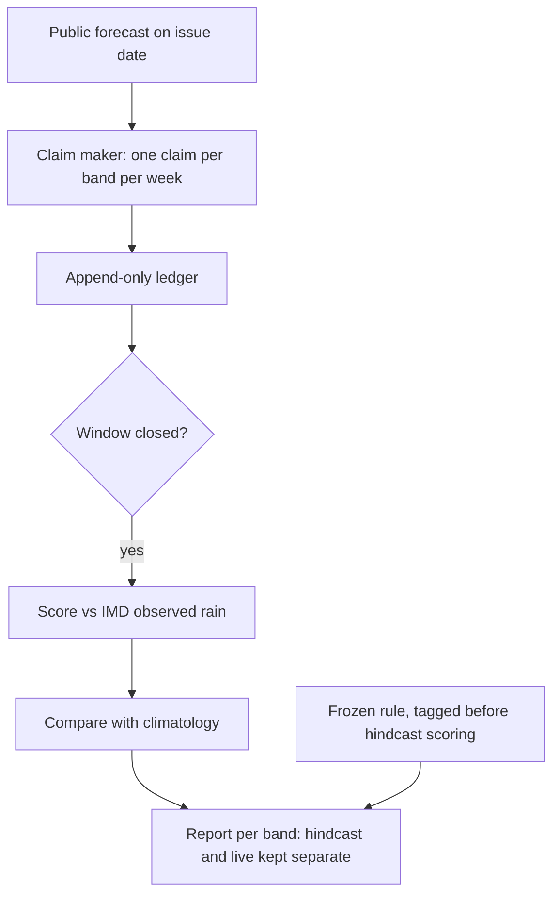

# Mandi Wheat Claim Ledger - Plan

## Goal Capsule

- **Objective:** For each altitude band in Mandi district, khetru can see from an honest, pre-registered record whether its sow-or-wait rain calls for rainfed wheat beat the crop calendar. The pre-registered hindcast gives the gate verdict; the live rabi 2027 season checks that live skill holds up against it.
- **Means:** A repo-resident claim ledger plus a minimal claim maker that starts by restating the public rain forecast per band.
- **Product authority:** This Product Contract, within the boundaries in `STRATEGY.md`. The website record page, call cards, and other ideation ideas (I2–I6 in `docs/ideation/2026-10-08-website-ideation.html`) are not active scope.
- **Open blockers:** None. The first check, this week, is whether archived as-issued forecasts exist for Mandi in Oct–Nov and whether the 0.25° grid separates the altitude bands (see Outstanding Questions).

---

## Product Contract

### Summary

Build a claim maker and an append-only claim ledger in the repo for Mandi rainfed wheat's sow-or-wait decision, per altitude band.
Claims are dated, checkable rain statements, scored weekly against IMD observed rainfall and against climatology.
A frozen rule is tagged before any hindcast scoring. Past seasons are then scored once as a labelled hindcast, which gives the gate verdict. Live rabi 2027 claims are appended as they are issued and checked against the hindcast's skill.

### Problem Frame

`STRATEGY.md:32` makes claim reliability the one metric the website stage can measure, and `STRATEGY.md:24` and `STRATEGY.md:26` hold the chat assistant and new data domains until it shows the insights hold.
Nothing measures it yet: `apps/`, `packages/` and `py/` are empty, and no claim has ever been made.

The councils warned that "honest uncertainty" may mean "we don't know" most of the time, and that the metrics had "no thresholds or kill criteria" (`.scratch/council-transcript-20261008-council-q4-metrics.md:47`).
Without a record, khetru cannot tell in which bands a sharp call has been earned and in which it should fall back to the calendar ("rain came in 7 of the last 10 years").

The Android app ships regardless of the result. The record is first for the project owner. The same record is expected to later decide where the app speaks sharply, satisfy the STRATEGY gates, and back outreach.

### Key Decisions

- **Ledger plus a minimal claim maker, not the ledger alone.** A ledger with no claims proves nothing, and no call engine exists. Governs R1–R6. (session-settled: user-directed — chosen over a ledger-only scope tested with stub claims, and over a hindcast-only first pass: one piece of work yields a scored record.)
- **Mandi district, rainfed wheat, sow-or-wait.** Wheat is Mandi's largest crop (~66k ha) and is mostly rainfed, and sowing is the highest-stakes timing call. Governs R3. (session-settled: user-approved — offered alongside maize, paddy, urea top-dressing timing, and spray windows; the user took the recommended default and accepted a thin record of about one claim per band per week.)
- **Claims are checkable weather statements, not farm advice.** Public data can confirm rain in a band but not germination or yield. Governs R2. (session-settled: user-approved — accepted as the stated constraint on what the ledger can prove.)
- **Climatology is the only baseline for now.** It is free and mechanical, while GKMS advisories are free text that would need manual coding. Governs R8. (session-settled: user-approved — chosen over climatology plus the GKMS block advisory; the record can claim "beats the calendar", not "beats the official advisory".)
- **Hindcast now, first live season rabi 2027.** The rabi 2026 sowing window opens about 15 Oct 2026, too soon for a working claim maker. Governs R11, R13. (session-settled: user-approved — chosen over going live in kharif 2027 on maize, which would have meant switching crops.)
- **Pass/fail is a skill score against climatology with a minimum claim count.** A bare hit rate rewards safe calls. Governs R13. (session-settled: user-approved — chosen over a fixed hit-rate bar.)
- **The record lives in the repo, not on the website.** The project owner is the only reader for now, and the public OSS repo already makes the record public. Governs R16. (session-settled: user-approved — chosen over a static record page per band on the website, which is deferred.)
- **The first claim rule restates the public forecast per band.** This is the cheapest claim maker. It tests whether the public forecast beats climatology per band, not whether khetru adds anything over public forecasts; that is measured only when a later named rule is scored side by side with this one. Governs R4. (session-settled: user-approved — chosen with the repo-only ledger as the recommended combination.)
- **The record's main use is a per-band switch for sharp calls versus the calendar.** The user said the record should serve every listed purpose without naming one as primary, so this is an assumption. Governs R17.
- **The hindcast gives the gate verdict; the live season is a consistency check; the rule is frozen per season.** One live season holds only about 4–6 independent weather regimes, so neither pooling nor a higher cadence makes a live-only verdict meaningful, and extra correlated claims would inflate N without adding evidence. Mid-season rule versions would let results shape the criteria. Governs R10, R13–R15, R17. (session-settled: user-approved — accepted from the council of 2026-10-08, `.scratch/council-transcript-20261008-council-q5-ledger-verdict.md`; chosen over a pooled live-only verdict, a higher claim cadence, and a pre-registered aggregation policy for mid-season rule versions.)

### Requirements

**Claims**

- R1. Each claim records its altitude band, the crop stage (wheat sowing), the claim window, the rain statement, the stated probability, the issue date, its expiry, and the source the probability came from.
- R2. Each claim is worded as a rain statement that public observations can confirm or refute for that band and window (for example "≥10 mm rain in band within 7 days: 60%"), never as a farm outcome.
- R3. Claims cover every altitude band in Mandi district that has rainfed wheat, for the rabi sowing window only.
- R4. The first claim rule derives each band's probability from the public rain forecast available on the issue date. The source must give an exceedance probability for the claim's threshold and window (for example from ensemble members); otherwise the rule names a fixed deterministic-to-probability conversion, committed with the rule and never tuned on outcomes. Later rules are added as new, named rules, never as silent edits to earlier ones.
- R5. A claim may say "can't tell" with a stated reason (for example, no forecast coverage for the band). It is recorded and scored like any other claim.
- R6. Once a claim is recorded it is never edited or deleted. Corrections are new entries that reference the original.

**Scoring**

- R7. Each claim is scored after its window closes, at least weekly, against IMD observed rainfall for that band. The result is held, missed, or "can't tell".
- R8. Each claim's score is compared with climatology's probability for the same band, window, and rain threshold.
- R9. A score computed from provisional observations is marked provisional. It is re-scored when final observations replace them, and the record shows both the change and the reason.
- R10. A band or season with fewer claims than the minimum N in the pass/fail rule shows "too early to tell", not a skill number presented as a verdict. "Too early to tell" is labelled visibly differently from "fail".
- R10a. A missed weekly issue date is recorded as a missed claim and never back-filled.

**Hindcast**

- R11. Past rabi seasons are scored using only forecasts as they were issued at each claim's issue date. A claim that would need data unavailable at that date is not made.
- R12. Hindcast and live claims are kept and reported separately and labelled at every point where a result is shown. A hindcast result is never presented as a live record.

**Pass/fail rule**

- R13. The rule states the rain threshold, the skill score, the threshold over climatology, the minimum N, the rainfall dataset version, and the settlement date by which observations are taken as final. The rain threshold is chosen from Oct–Nov climatology to fire in roughly 30–50% of weeks, but agronomic relevance to sow-or-wait (CSK HPKV or ICAR guidance) governs: if the relevant threshold fires less often, keep it and compute the power calculation and minimum N at its actual base rate. The rule judges two things, each with exactly three outcomes (pass, fail, too early to tell): the hindcast verdict, and the rabi 2027 live check, pooled across bands and pre-registered as "live skill is not significantly worse than hindcast skill". The live check is a non-inferiority test with a pre-registered margin: pass when the upper confidence bound of (hindcast skill − live skill) is below the margin, fail when the lower bound is above it, otherwise too early to tell. The margin and confidence level are fixed when the rule is tagged, using the power calculation. The STRATEGY gates open only if both pass.
- R14. The rule is committed and tagged in the repo before any hindcast claim is scored, and that tag serves as pre-registration. The rule version tagged before the first live claim judges the whole rabi 2027 season. A later change is a new dated version that keeps the old one and takes effect from the next season; any mid-season variant, including pre-registered challenger rules, is reported only as exploratory and never changes that season's verdict. Each rule's hindcast is scored once, under a tag made before that run; a re-run or a later rule never replaces an earlier hindcast verdict. Rule tags are never moved or deleted, and the report lists every rule tag and every hindcast run with its date.
- R15. When rabi 2027 ends, the record states the hindcast verdict, the pooled live check, and each verdict band's status in plain language, including "the calendar is as good as we are" when that is the result. Per-band "too early to tell" after rabi 2027 is the expected result, stated as such.

**Record**

- R16. A generated report in the repo shows, per band and in total, the claim counts, outcomes, and skill against climatology, with hindcast and live results separate and each claim rule's skill shown separately.
- R17. For each band the report states whether sharp calls have been earned (pass) or the band falls back to the climatology baseline (fail or too early to tell). A band stays on the calendar until its live claims, accumulated across seasons, reach N and pass, and also stays on the calendar unless the cost-loss check (a wrong "wait" against a wrong "sow") shows the chosen threshold and window can improve the sow-or-wait decision. A band gets its own verdict only if its observed rainfall comes from grid cells (or gauges) not shared with adjacent bands; bands that share observation cells are merged into one verdict band before the pass/fail rule is committed. Bands count as independent only when their observations come from distinct gauges, not merely distinct interpolated grid cells. If fewer than two independent verdict bands remain, the switch is district-wide (one verdict band); scoring against station gauges per band is deferred.
- R18. Nothing in the ledger, scoring, or report uses farmer data, visitor data, or farm coordinates.

### Key Flows

- F1. Weekly live cycle (rabi 2027)
  - **Trigger:** A weekly issue date falls inside the wheat sowing window.
  - **Steps:** Issue one claim per band from the forecast available that day; append it to the ledger; score claims whose windows have closed; regenerate the report.
  - **Outcome:** The ledger grows and the report reflects all closed claims.
  - **Covered by:** R1–R10, R16, R17
- F2. Hindcast run
  - **Trigger:** Run once, after the rule is tagged; re-run whenever a new claim rule is added (reported per rule, R16).
  - **Steps:** For each past rabi season and weekly issue date, issue claims using only forecasts as they were issued; score them against final observations; record them as hindcast.
  - **Outcome:** The record does not open at zero, and the hindcast stays visibly separate from the live record.
  - **Covered by:** R4, R11, R12, R16
- F3. Season close
  - **Trigger:** The rabi 2027 sowing window ends and its last claim windows have closed.
  - **Steps:** Apply the frozen rule: the pooled live check against hindcast skill, and each band's accumulated live claims against N.
  - **Outcome:** The pooled live check and each band are marked pass, fail, or too early to tell, stated in plain language.
  - **Covered by:** R13, R15, R17

### Acceptance Examples

- AE1. **Covers R10, R13.** Given a band with 4 live claims and a rule minimum of N = 12, when the season closes, then that band shows "too early to tell" and falls back to the climatology baseline, even if all 4 claims held.
- AE2. **Covers R9.** Given a claim scored "held" on provisional IMD data, when the final data shows rain below the threshold, then the claim is re-scored "missed" and the record shows the change and its reason.
- AE3. **Covers R5, R7.** Given a band with no forecast coverage on an issue date, when the claim maker runs, then it records "can't tell — no forecast coverage for this band", and that claim is counted in scoring.
- AE4. **Covers R14.** Given the rule was tagged on 2027-09-20, when a new threshold is committed on 2027-11-01, then the 2027-09-20 rule still judges the whole rabi 2027 season, the new version's scores appear only as exploratory, and it takes effect from rabi 2028.
- AE5. **Covers R11.** Given a hindcast issue date of 2023-10-20, when no archived forecast issued on or before that date exists for a band, then no hindcast claim is made for that band and date. Later data is never used to fill the gap.

### Success Criteria

- Before the first live rabi 2027 claim, the repo holds a rule tagged before hindcast scoring and a scored hindcast verdict, or a written finding that no archive of as-issued forecasts exists, or that the archive is too short to reach the pre-registered N (hindcast verdict "too early to tell"). In either case the gate cannot be met before about 2029, and STRATEGY must name a replacement gate (date to be set in planning).
- At the end of rabi 2027, the pooled live check and every Mandi wheat verdict band (bands merged under R17) have a stated outcome of pass, fail, or too early to tell, and someone who was not involved can trace each outcome from claims to scores to the rule.

### Scope Boundaries

- Deferred: a website record page per band, call cards, band permalinks, and voice or icon output.
- Deferred: the GKMS block advisory as a second baseline.
- Deferred: other crops (maize, paddy) and other decisions (urea top-dressing timing, spray windows).
- Deferred: claim rules beyond the restated public forecast, until the hindcast shows where the forecast falls short.
- Optional: hand-issued, unscored rehearsal claims during rabi 2026 (from about 15 Oct 2026) to surface data-latency, band-definition and forecast-access problems. Labelled rehearsal; never part of any verdict.
- Not in scope: any farmer- or visitor-facing input, including village selection or GPS.
- Not in scope: verifying farm outcomes such as germination, yield, or money saved.

### Dependencies / Assumptions

- The record's main use is the per-band switch in R17. The STRATEGY gates on the chat assistant and new data domains, and outreach, are expected to follow from the same record. This is an assumption, because the user did not name a primary purpose.
- A forecast source with archived as-issued forecasts covering past Mandi rabi seasons exists. If it does not, the hindcast shrinks or is dropped (R11, AE5).
- IMD daily gridded rainfall (~0.25°, about 27 km) is the observation source. Its cells span several altitude bands, so band-level scoring is approximate (unverified: Mandi's altitude range of roughly 500–4000 m).
- With about one claim per band per week across the roughly 15 Oct to 15 Nov window, one live season will not reach the minimum N in any band; per-band verdicts accumulate across seasons (R17).
- The Android app proceeds regardless of the outcome. A fail limits only sharp calls and the STRATEGY gates.

### Outstanding Questions

**Deferred to Planning**

- Which forecast source supplies both live and archived as-issued forecasts for Mandi, and how many past rabi seasons it covers.
- The band edges for Mandi, and which bands actually grow rainfed wheat.
- The rain threshold and claim window that matter for the sow-or-wait decision (the default example is ≥10 mm within 7 days), checked against CSK HPKV or ICAR guidance and against the 30–50% base-rate target in R13.
- The skill score, its threshold over climatology, and the minimum N, chosen with a power calculation: what skill difference the hindcast and N can detect at the chosen base rate, counting independent rain events rather than claims.
- What a pooled live-check or hindcast fail means for the STRATEGY gates, and what a pass unlocks (which claim types and decisions, given the rule restates the public rain forecast), stated before the rule is tagged.
- Which rule version judges a band's live claims accumulated across seasons (R17) when the rule changes between seasons (R14), stated before the rule is tagged.
- Whether forecast skill changes the sow-or-wait decision for the better (a simple cost-loss check of a wrong "wait" against a wrong "sow"), and whether the calendar fallback itself holds up. The answer gates sharp-call eligibility in R17.
- Whether the sowing-relevant rain event is too rare for a usable record: mid-hill winter rain starts within 15 Oct–15 Nov in only about 10% of years (CRIDA/HPKV note), far below R13's 30–50% target. Check the real weekly base rate in IMD data; if it is low, decide whether to score "next rain before the sowing cutoff" instead of "rain within 7 days", before the rule is tagged.
- How a "can't tell" claim enters the skill score.
- How many years of climatology are used per band, given sparse Himachal station history.

### Sources / Research

- `STRATEGY.md:24`, `STRATEGY.md:26`, `STRATEGY.md:32`, `STRATEGY.md:38`, `STRATEGY.md:56`: claim reliability metric, gates, privacy, website PoC role.
- `.scratch/council-transcript-20261008-council-q4-metrics.md:70`: calibrate per altitude band; reward honest "can't tell".
- `.scratch/council-transcript-20261008-council-q4-metrics.md:47`: critique, "No thresholds or kill criteria."
- `.scratch/council-transcript-20261008-council-q1.md:42`: one district, one crop.
- `docs/ideation/2026-10-08-website-ideation.html`: idea I1, the origin of this plan.
- `.scratch/council-transcript-20261008-council-q5-ledger-verdict.md`: council verdict on the hindcast gate and the per-season rule freeze.
- ICAR-CRIDA Mandi contingency plan (crop areas, monsoon timing): https://www.icar-crida.res.in/CP/HimachalPradesh/HP7-Mandi-31.12.2012.pdf
- KVK Mandi district profile: https://hillagric.ac.in/extension/dee-extra/KrishiVigyanKendras/kvk_mandi/pdf/AboutDistrict.pdf
- ICAR rabi advisory for Himachal (wheat sowing windows): https://vikaspedia.in/agriculture/crop-production/tips-for-farmers/icar-agri-advisory-for-rabi-2021-22/icar-rabi-season-agro-advisory-for-himachal-pradesh
- IMD 0.25° gridded daily rainfall: https://mausamjournal.imd.gov.in/index.php/MAUSAM/article/view/851
- Real-time IMD gridded data is provisional and revised later: https://archive.linux.duke.edu/cran/web/packages/imdR/vignettes/imdR-introduction.Rmd
- Cost-loss inputs (desk estimate 2026-10-08, low–medium confidence; C/L ≈ 0.08–0.34 mid hills, 0.05–0.2 low hills, 0.3–0.8 high hills; reseeding cost largely assumed):
  - CRIDA/HPKV rainfed technical note (moisture for sowing, re-sow below 50% stand, mid-hill winter rain onset 15 Oct–15 Nov in ~10% of years, AICRP sowing-date yields by station): https://zenodo.org/records/14292957
  - Palampur sowing-date trials (late-sowing penalty ~0.15–0.5%/day, irrigated or unstated): https://www.plantarchives.org/17-2/1439-1443 (3733).pdf
  - HP wheat seed price 2024-25: https://www.tribuneindia.com/news/himachal/wheat-seeds-now-available-at-agriculture-sales-centres
  - Wheat MSP RMS 2027-28, Rs 2,610/q: https://thefederal.com/category/news/cabinet-approves-rs-25-hike-in-wheat-msp-to-rs-2610-per-quintal-for-2027-28-258133
